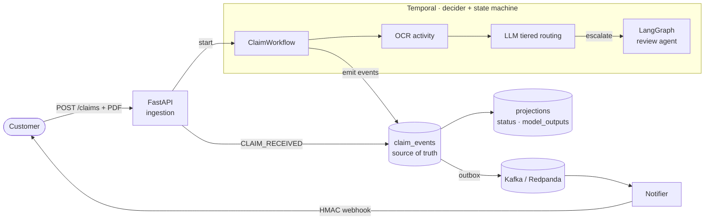

# claimpipe

[](https://github.com/gpatwa/insurance-claim-ai/actions/workflows/ci.yml)
[](LICENSE)


> **Cloud-agnostic claim-ingestion pipeline.** A PDF + JSON "claim" is logged → run through OCR →
> scored by multiple LLM models (tiered routing) → persisted → the customer is notified by
> webhook. Portable, self-hosted, and **event-sourced**.

🌐 **[Landing page](https://gpatwa.github.io/insurance-claim-ai)** · 🧭 [Design](docs/DESIGN.md) · 🚀 [Deploy](docs/DEPLOY.md) · ✅ [Verify](docs/VERIFY.md)

## Architecture



## Stack — portable, self-hosted (same code local → any cloud)

| Concern | Tech |
|---|---|
| Durable orchestration / decider | **Temporal** (self-hosted) |
| Source of truth | **event-sourced** append-only `claim_events` (Postgres) |
| Read models | projections folded from events (status, model_outputs) |
| Event bus (fan-out) | **Kafka / Redpanda** via transactional **outbox** + relay |
| Workers / API | **Python** (`temporalio`, FastAPI) |
| Object storage | **S3 API** behind an adapter (MinIO local) |
| LLMs | mix of providers behind one `ModelClient` adapter (Claude via Bedrock/Vertex/API) |
| Agent reasoning (escalation) | **LangGraph** inside a Temporal activity |

**State model:** the Temporal workflow is the authoritative decider and emits **domain events**;
`claim_events` is the append-only source of truth; the status enum and other read models are
**projections** folded from events (transitions validated in one place). Kafka is the fan-out
**bus** — not the source of truth — fed by a transactional outbox so no event is ever lost.

Design rationale: [`docs/DESIGN.md`](docs/DESIGN.md).

## Quickstart

```bash
make install          # uv sync (all extras + dev)
make test             # hermetic tests (Temporal in-process test env — no Docker needed)
make up               # bring up Temporal + Postgres + MinIO + Redpanda locally
make smoke            # full-stack E2E smoke: real services + seeded reference data
make worker           # run the Temporal worker
make down             # tear down
```

Temporal Web UI: http://localhost:8233 · MinIO console: http://localhost:9001

## Milestones

Each milestone is independently end-to-end tested and pushed.

- [x] **M0** — Repo scaffold + local harness (Docker Compose, adapter Protocols, CI, smoke workflow)
- [x] **M1** — Ingestion API + claim record (FastAPI, idempotent submit, start workflow, status endpoint)
- [x] **M2** — OCR activity + object storage (upload dormancy gate, retry/backoff, S3 adapter)
- [x] **M2.5** — Event-sourced foundation (append-only `claim_events`, validated projection, outbox, Kafka/Redpanda bus, relay)
- [x] **M3** — LLM tiered routing + persistence (cost-tier→confidence-gate→escalate, structured output, `model_outputs` projection)
- [x] **M4** — Webhook notification (Kafka consumer of CLAIM_PERSISTED, HMAC-signed, retries → NOTIFY_FAILED)
- [x] **M5** — LangGraph escalation agent (extract→validate→recommend→critic, inside a Temporal activity, on the escalated tier)
- [x] **M6** — Observability (structured logs per `claim_id`, OTel tracing) + DLQ replay + burst-load + LLM chaos tests
- [x] **M7** — Cloud deploy: one image / four roles, Dockerfile, Helm chart, Terraform, deploy docs, CI helm+terraform lint
- [x] **M8** — Claim-type registry + schema-driven intake (per-type attribute schemas validated at the API edge)
- [x] **M9** — Pipeline-as-config engine (per-claim-type stage lists; lines of business are configuration, not code)
- [x] **M10** — Adjudication core (versioned decision tables → APPROVE/DENY/PEND + reason codes; rules decide, LLM prepares)
- [x] **M11** — Human-in-the-loop review (REVIEW dormancy gate, work queue, reviewer verdict API, audit trail)
- [x] **M12** — Intake & output adapters (FNOL / X12-style in via `/intake/{format}`; EOB + denial letter out via `/claims/{id}/documents/{format}`)
- [x] **M13** — Reference data + multi-tenancy (policy-grounded adjudication facts; per-tenant registries/rule sets)
- [x] **M14** — Customer front door (API-key auth → customer/tenant/roles, claim ownership, real presigned upload URLs)

## Claim types (pipeline-as-config)

A **claim type** declares, as data, the attribute schema its metadata must satisfy and the
pipeline stages the engine executes — so adding a line of business is registering a
definition, not writing a workflow. Stage vocabulary: `UPLOAD → OCR → LLM → ADJUDICATE →
REVIEW → PERSIST`.

| Seeded type | Stages | Purpose |
|---|---|---|
| `generic-document` | UPLOAD → OCR → LLM → ADJUDICATE → REVIEW → PERSIST | full pipeline (default) |
| `auto-fnol` | UPLOAD → OCR → LLM → ADJUDICATE → REVIEW → PERSIST | demo line: required attributes + limit rules |
| `archive-document` | UPLOAD → OCR → PERSIST | OCR + store, no scoring/decision |
| `metadata-only` | PERSIST | structured-data claim, no document |
| `structured-claim` | ADJUDICATE → REVIEW → PERSIST | e.g. EDI: arrives structured, rules decide directly |

**Adjudication:** deterministic, versioned decision tables (first match wins) decide
`APPROVE / DENY / PEND` with reason codes — **rules decide, the LLM only prepares facts**.
Unmatched claims PEND (never auto-approve by fallthrough), and every decision event records
the rule set version, matched rule, and facts — an audit trail by construction.

**Human-in-the-loop review:** PEND decisions park at a durable **REVIEW dormancy gate**
(scale-to-zero, 30-day window). Reviewers work a queue (`GET /review-queue`) and post a
verdict (`POST /claims/{id}/review`), which signals the workflow and overrides the PEND —
with the reviewer recorded on the `REVIEW_COMPLETED` event. If nobody acts, the claim
persists still-PEND: the system never decides on the human's behalf.

**Customer front door:** every endpoint (except `/healthz`) requires `X-API-Key`. The key
resolves to a customer — its `customer_id` is **stamped onto claims** (never trusted from the
body), its **tenant** selects the configuration (never trusted from a header), and its roles
gate access: `submit` (claims in/out, own claims only) vs `review` (the tenant's work queue).
Submitters get a **real presigned PUT URL** (15-min TTL) to upload documents directly to
object storage. Keys are stored hashed; predefined dev keys live in `claimpipe/customers.py`
(`ck_dev_all_01` etc.) — production loads hashed keys via `CLAIMPIPE_CUSTOMERS_FILE`.

**Reference data & tenancy:** adjudication facts are grounded in what the carrier *knows*
(policy status via a `RefDataSource`), not just what the claimant *says* — an inactive policy
denies regardless of the submission. Each tenant (`X-Tenant-ID`) gets its own claim-type
registry and rule sets on one deployment; the `default` tenant keeps single-tenant setups
zero-config.

**Intake & output adapters:** external formats normalize into canonical claims via
`POST /intake/{format}` (seeded: `fnol` carrier JSON, `x12-837` demo-grade EDI-shaped reader —
the seam where a real clearinghouse adapter drops in), and decided claims render as outbound
documents via `GET /claims/{id}/documents/{format}` (seeded: `eob` JSON remittance,
`denial-letter`; adapters render, never decide).

The resolved stage list is **pinned into the workflow input at submission** — registry changes
never affect in-flight claims. Discover types at `GET /claim-types`.

## Design principles

- **Event log is the source of truth; status is a projection** — the workflow emits domain
  events, and read models (the `ClaimStatus` enum, `model_outputs`) are folded from them with
  transitions validated in one place. The LLM never drives transitions.
- **Adapters everywhere** — OCR, object store, message bus, and LLM providers sit behind
  Protocols, so swapping cloud/provider is a config change, not a rewrite.
- **Event-driven dormancy gates, not polling** — long waits (PDF upload, human review) are
  Temporal timers/signals resumed via webhook, scale-to-zero while waiting.
- **Local/prod parity** — the workflow you debug locally is the workflow that runs in prod;
  CI is fully hermetic (Temporal in-process test env, no Docker).

## License

MIT
